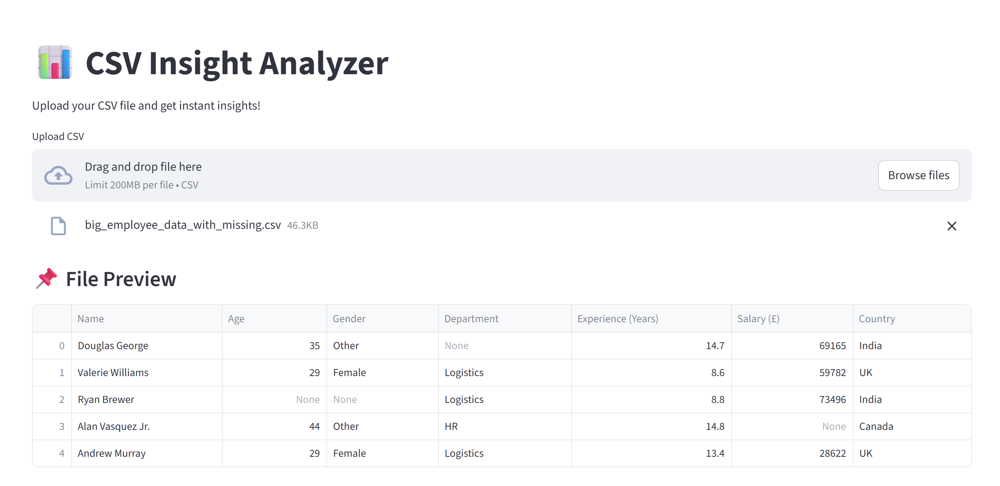
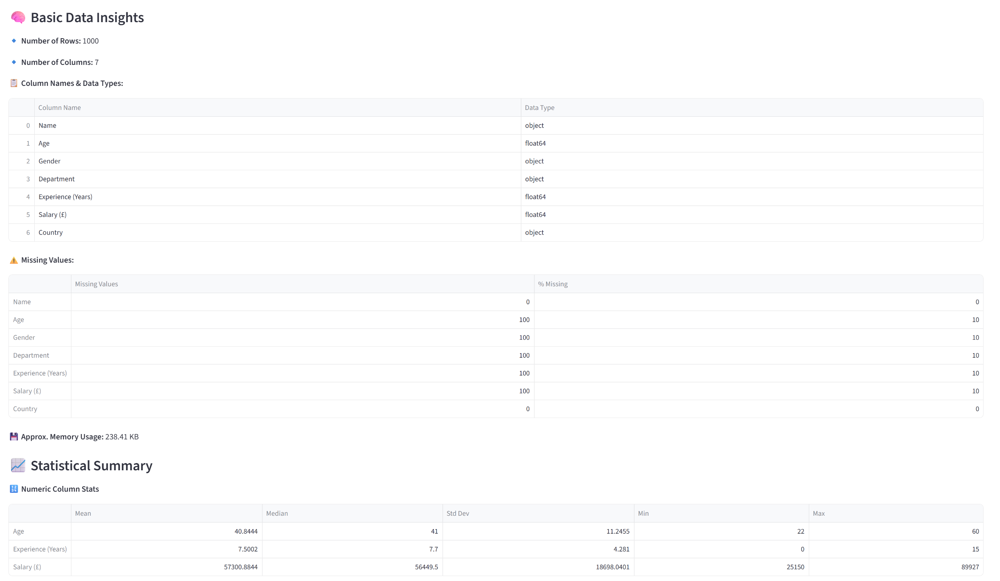
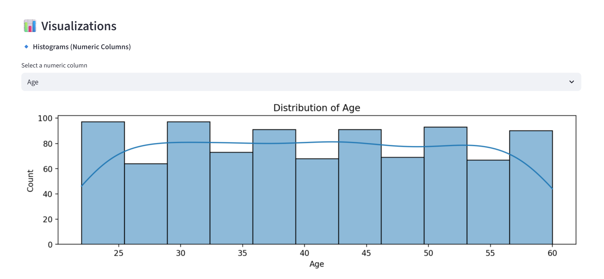
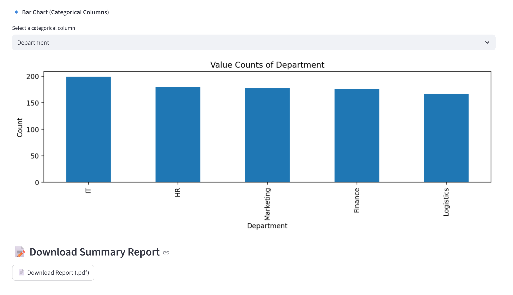

# 📊 CSV Insight Analyzer

A powerful and beginner-friendly web app built with **Streamlit** that allows users to upload messy or clean CSV files and instantly get deep insights — including:

✅ Column types  
✅ Missing values  
✅ Numeric stats (mean, median, std, etc.)  
✅ Categorical breakdowns  
✅ Data visualizations (histograms & bar charts)  
✅ PDF export report (with embedded graphs!)  
✅ Auto-fix support for tab/pipe/semicolon-separated messy files

---

## 🚀 Features

- **Robust CSV Reader**: Auto-detects delimiter & encoding
- **Clean Summary View**: Rows, columns, nulls, dtypes
- **Visual Analysis**: Histograms & bar charts (Matplotlib + Seaborn)
- **PDF Report Export**: All insights + visual charts included
- **Streamlit UI**: Clean, interactive & responsive

---

## 📷 Screenshots

### 🔹 File Upload & Preview


### 🔹 Data Summary & Insights


### 🔹 Visualizations (Histogram Chart)


### 🔹 Bar Chart & Downloadable PDF Report Button



---

## 🧠 Tech Stack

- `Python`
- `Pandas`
- `Matplotlib`, `Seaborn`
- `Streamlit`
- `ReportLab` (for PDF generation)

---

## 🌐 Live Demo

🔗 [https://csv-insight-analyzer.onrender.com](https://csv-insight-analyzer.onrender.com)

---

## 🛠 How to Run Locally

```bash
git clone https://github.com/VarunDasharadhi/csv-insight-analyzer.git
cd csv-insight-analyzer
pip install -r requirements.txt
streamlit run app.py
```
---
## 👨‍💻 Author
Made with 💡 by Varun Dasharadhi  
Feel free to ⭐️ the repo, fork it, or open a pull request!
